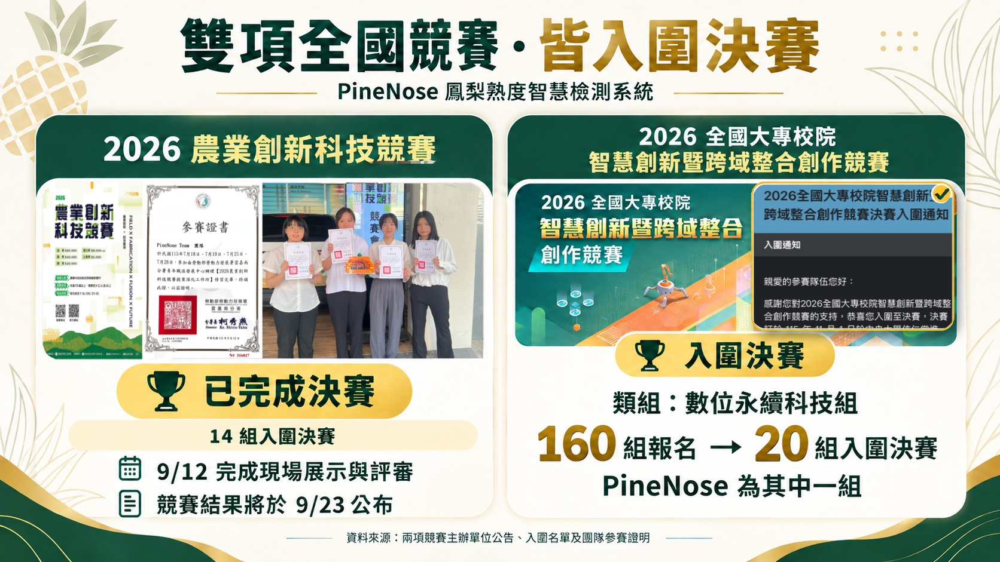

<div align="center">

# 🍍 PineNose 鳳梨熟度智慧檢測系統
### PineNose — Pineapple Smart Ripeness Assessment System

**電子鼻成熟度辨識 × 影像品種辨識 × Web 系統 × 雙端 App**

長庚大學資訊工程學系｜畢業專題

</div>

---
## 成果展示影片

PineNose｜鳳梨電子鼻非破壞性熟度檢測系統  
完整系統介紹與實際操作展示：
[YouTube｜PineNose 系統展示影片](https://www.youtube.com/watch?v=X8AnxetTEi4)
## 專案簡介

PineNose 是一套結合電子鼻感測、機器學習與影像辨識的鳳梨智慧檢測系統，目標是在不破壞果實的情況下，提供鳳梨成熟度與品種辨識結果，並透過網頁及行動 App 整合檢測流程與歷史紀錄。

系統目前整合：

- 電子鼻鳳梨成熟度辨識
- YOLOv8 + EfficientNet-B0 鳳梨影像品種辨識
- Raspberry Pi 3 邊緣推論與 Web 服務
- 農民端 App
- 消費端 App
- VM / Docker 後端服務與資料儲存
- 歷史檢測紀錄與系統整合介面

---

## 📂 程式碼位置

本專題目前使用的主要程式碼與三下期末整合版本相同，程式碼統一放置於 GitHub Repository 的下列路徑：

**`Semester 2 Final Exam (三下-期末)/`**

GitHub：

https://github.com/icguproject25-droid/electronic-nose-pineapple-ripeness-assessment/tree/main/Semester%202%20Final%20Exam%20(%E4%B8%89%E4%B8%8B-%E6%9C%9F%E6%9C%AB)

主要資料夾包含：

```text
Semester 2 Final Exam (三下-期末)/
├── app/                         # 農民端與消費端 App
├── enose_model_training/        # 電子鼻模型訓練
├── pineapple_app_gateway/       # App / Web API Gateway
├── pineapple_deployment_system/ # Arduino 感測器程式
├── pineapple_detection/         # 影像品種辨識
├── pineapple_final/             # Raspberry Pi 電子鼻推論系統
├── 整合網頁/                    # PineNose 整合 Web 介面
└── 設計文件 & 簡報/             # 專題相關文件
```

> 本 README 以目前畢業專題與競賽展示狀況進行補充；實際程式內容請以上述 `Semester 2 Final Exam (三下-期末)` 路徑為準。

---

## 系統架構

```text
電子鼻感測端
Arduino Mega 2560
├── MQ-2
├── MQ-3
├── MQ-9
├── MQ-135
├── TGS2602
└── BME280
        │
        ▼
Raspberry Pi 3
├── 30 秒空氣校正
├── 30 秒鳳梨氣味取樣
├── 成熟度模型推論
├── 整合 Web
└── App Gateway
        │
        ├──────────► 農民端 App
        ├──────────► 消費端 App
        └──────────► 歷史資料 / 資料庫

影像辨識端
圖片 / 相機
        │
        ▼
YOLOv8 鳳梨偵測
        │
        ▼
EfficientNet-B0 品種分類
        │
        ▼
Flask API / VM Docker
```

---

## 電子鼻成熟度辨識

電子鼻系統透過多組氣體感測器取得鳳梨揮發性氣體訊號，搭配溫濕度資料進行特徵處理，再由模型判斷成熟階段。

成熟度目前分為四階段：

| Stage | 說明 |
|---|---|
| Stage 0 | 未熟 |
| Stage 1 | 初熟 |
| Stage 2 | 成熟 |
| Stage 3 | 過熟 |

主要部署於 Raspberry Pi 3，現場版採用約 30 秒的量測視窗進行推論。

---

## 影像品種辨識

影像辨識流程採兩階段模型：

1. **YOLOv8n**：確認畫面中的鳳梨並定位。
2. **EfficientNet-B0**：進行鳳梨品種分類。

影像辨識服務透過 Flask 提供 API，並可部署於 VM / Docker 環境中供 App 與整合網頁呼叫。

---

## Web 與 App

系統提供三種主要操作介面：

- **整合 Web**：集中呈現電子鼻成熟度與影像辨識結果。
- **農民端 App**：提供批次檢測、紀錄與農業端管理流程。
- **消費端 App**：提供使用者檢測與歷史紀錄查詢。

後端服務與資料儲存則依系統模組部署於 Raspberry Pi 與 VM / Docker。

---

# 🏆 競賽與成果

PineNose 除作為長庚大學資訊工程學系畢業專題外，也以完整系統參與全國性競賽。

## 2026 農業創新科技競賽

- 隊名：**PineNose Team**
- 作品：**PineNose 鳳梨熟度智慧檢測系統**
- 入圍決賽隊伍：**14 組**
- **2026/09/12 已完成決賽現場展示與評審**
- 競賽結果預計於 **2026/09/23 公布**

## 2026 全國大專校院智慧創新暨跨域整合創作競賽

- 類組：**數位永續科技組**
- 該類組報名：**160 組**
- 入圍決賽：**20 組**
- PineNose 為其中一組入圍團隊

---

## 📸 競賽成果紀錄

下圖整理 PineNose 於 2026 年參與之兩項全國競賽與入圍／決賽狀況。



---

## 主要技術

| 類別 | 技術 |
|---|---|
| 感測硬體 | Arduino Mega 2560、Raspberry Pi 3 |
| 氣體感測 | MQ-2、MQ-3、MQ-9、MQ-135、TGS2602 |
| 環境感測 | BME280 |
| 成熟度模型 | ExtraTrees / 蒸餾模型 |
| 影像偵測 | YOLOv8n |
| 影像分類 | EfficientNet-B0 |
| Backend | Python、Flask |
| Frontend | HTML / CSS / JavaScript |
| Mobile App | React Native / Expo |
| 部署 | Raspberry Pi、VM、Docker |
| 資料管理 | 歷史檢測資料與後端資料庫 |

---

## 開發團隊

**長庚大學 資訊工程學系**

| 姓名 |
|---|
| 陳玟妤 |
| 林冠妤 |
| 陳怡禎 |
| 廖文歆 |

指導教授：**張哲維 教授**

---

## Repository

完整專題 Repository：

https://github.com/icguproject25-droid/electronic-nose-pineapple-ripeness-assessment

目前程式版本請直接參考：

**`Semester 2 Final Exam (三下-期末)/`**

---

## License

本專案授權方式請依 Repository 內現有 License 文件為準。
